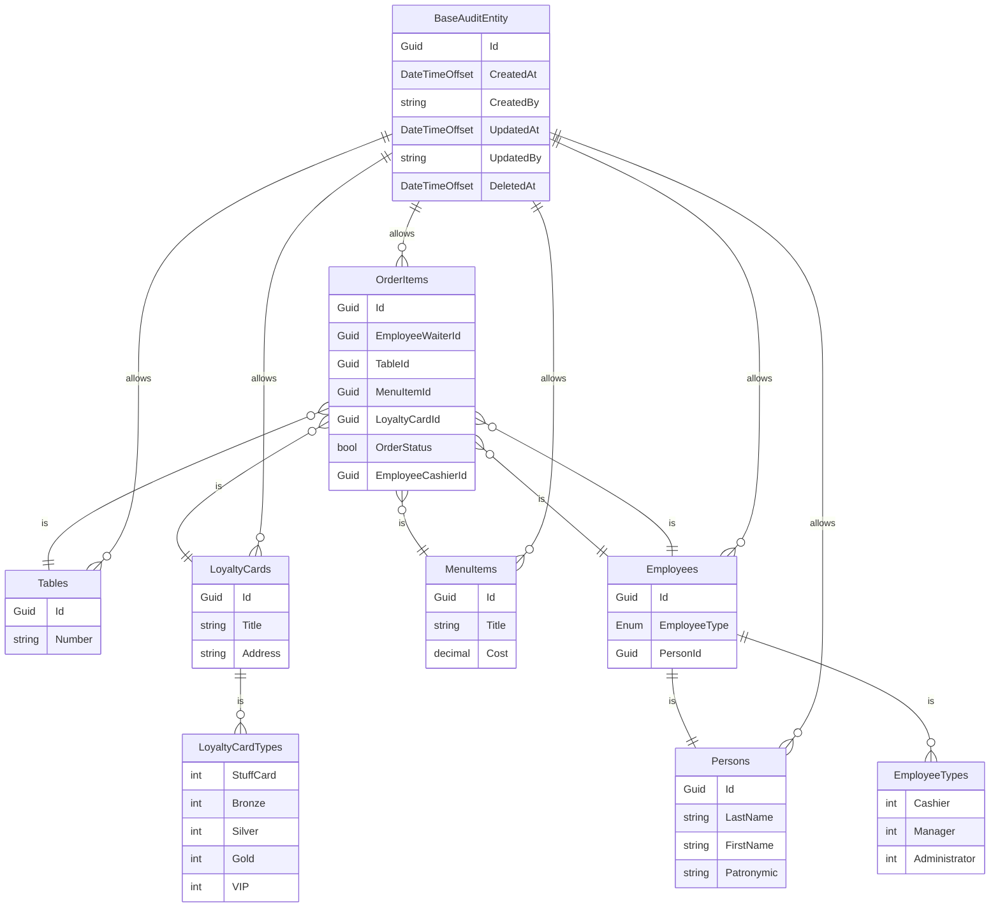

Бизнес домен
---
Ресторан

Описание предметной области
---
Автоматизация продажи управления заказами в ресторане

Автор
---
Конев Ефим Викторович студент группы ИП 20-3

Схема моделей
---

Пример реального бизнес сценария
---

SQL скрипт
---
```
INSERT [dbo].[Employees] ([Id], [EmployeeType], [PersonId], [CreatedAt], [CreatedBy], [UpdatedAt], [UpdatedBy], [DeletedAt])
VALUES (N'fc453067-e194-4f5b-a11d-bf57048d4e89', 0, N'e3852ed3-ea0e-45b3-a7dc-042b3f7b1640', CAST(N'2023-12-23T01:54:17.2595496+00:00' AS DateTimeOffset), N'AutoRest.Api', CAST(N'2023-12-23T01:54:17.2595586+00:00' AS DateTimeOffset), N'AutoRest.Api', NULL)

INSERT [dbo].[Employees] ([Id], [EmployeeType], [PersonId], [CreatedAt], [CreatedBy], [UpdatedAt], [UpdatedBy], [DeletedAt])
VALUES (N'b6da07a5-287e-42ef-9cff-e23c9d08182a', 1, N'f4c14060-b8d5-4762-9d43-de2b357e6e86', CAST(N'2023-12-23T01:33:58.8820787+00:00' AS DateTimeOffset), N'AutoRest.Api', CAST(N'2023-12-23T01:33:58.8820920+00:00' AS DateTimeOffset), N'AutoRest.Api', NULL)

INSERT [dbo].[LoyaltyCards] ([Id], [LoyaltyCardType], [Number], [CreatedAt], [CreatedBy], [UpdatedAt], [UpdatedBy], [DeletedAt])
VALUES (N'9deda7d8-8209-44de-8325-678f3f31571c', 0, N'23455334', CAST(N'2023-12-23T01:32:13.4673278+00:00' AS DateTimeOffset), N'AutoRest.Api', CAST(N'2023-12-23T01:32:13.4675236+00:00' AS DateTimeOffset), N'AutoRest.Api', NULL)

INSERT [dbo].[MenuItems] ([Id], [Title], [Cost], [CreatedAt], [CreatedBy], [UpdatedAt], [UpdatedBy], [DeletedAt])
VALUES (N'9f3d7a30-8c4c-4c73-8694-257d72bcb92d', N'Soup', CAST(50.00 AS Decimal(18, 2)), CAST(N'2023-12-23T01:32:33.7601814+00:00' AS DateTimeOffset), N'AutoRest.Api', CAST(N'2023-12-23T01:32:33.7601933+00:00' AS DateTimeOffset), N'AutoRest.Api', NULL)

INSERT [dbo].[OrderItems] ([Id], [EmployeeWaiterId], [TableId], [MenuItemId], [LoyaltyCardId], [OrderStatus], [EmployeeCashierId], [CreatedAt], [CreatedBy], [UpdatedAt], [UpdatedBy], [DeletedAt], [EmployeeCashierId1])
VALUES (N'c761cef1-01b4-42a1-9dfe-379da56b98b6', N'b6da07a5-287e-42ef-9cff-e23c9d08182a', N'549ecee9-5114-4968-ab3b-d84aebd027a5', N'9f3d7a30-8c4c-4c73-8694-257d72bcb92d', N'9deda7d8-8209-44de-8325-678f3f31571c', 0, NULL, CAST(N'2023-12-23T01:51:26.8929404+00:00' AS DateTimeOffset), N'AutoRest.Api', CAST(N'2023-12-23T01:51:26.8931483+00:00' AS DateTimeOffset), N'AutoRest.Api', NULL, NULL)

INSERT [dbo].[OrderItems] ([Id], [EmployeeWaiterId], [TableId], [MenuItemId], [LoyaltyCardId], [OrderStatus], [EmployeeCashierId], [CreatedAt], [CreatedBy], [UpdatedAt], [UpdatedBy], [DeletedAt], [EmployeeCashierId1])
VALUES (N'fd4b1f5c-a3e2-4930-97ba-c8f83e0ee853', N'b6da07a5-287e-42ef-9cff-e23c9d08182a', N'549ecee9-5114-4968-ab3b-d84aebd027a5', N'9f3d7a30-8c4c-4c73-8694-257d72bcb92d', N'9deda7d8-8209-44de-8325-678f3f31571c', 0, N'b6da07a5-287e-42ef-9cff-e23c9d08182a', CAST(N'2023-12-23T01:52:54.2737870+00:00' AS DateTimeOffset), N'AutoRest.Api', CAST(N'2023-12-23T01:52:54.2738070+00:00' AS DateTimeOffset), N'AutoRest.Api', NULL, NULL)

INSERT [dbo].[Persons] ([Id], [LastName], [FirstName], [Patronymic], [CreatedAt], [CreatedBy], [UpdatedAt], [UpdatedBy], [DeletedAt])
VALUES (N'e3852ed3-ea0e-45b3-a7dc-042b3f7b1640', N'Nikolaev', N'Vyacheslav', NULL, CAST(N'2023-12-23T01:53:43.9827153+00:00' AS DateTimeOffset), N'AutoRest.Api', CAST(N'2023-12-23T01:53:43.9827231+00:00' AS DateTimeOffset), N'AutoRest.Api', NULL)

INSERT [dbo].[Persons] ([Id], [LastName], [FirstName], [Patronymic], [CreatedAt], [CreatedBy], [UpdatedAt], [UpdatedBy], [DeletedAt])
VALUES (N'f4c14060-b8d5-4762-9d43-de2b357e6e86', N'Konev', N'Yefim', N'Viktorovich', CAST(N'2023-12-23T01:32:52.5994278+00:00' AS DateTimeOffset), N'AutoRest.Api', CAST(N'2023-12-23T01:33:38.7891715+00:00' AS DateTimeOffset), N'AutoRest.Api', NULL)

INSERT [dbo].[Tables] ([Id], [Number], [CreatedAt], [CreatedBy], [UpdatedAt], [UpdatedBy], [DeletedAt])
VALUES (N'549ecee9-5114-4968-ab3b-d84aebd027a5', N'13', CAST(N'2023-12-23T01:38:05.4017546+00:00' AS DateTimeOffset), N'AutoRest.Api', CAST(N'2023-12-23T01:38:05.4017695+00:00' AS DateTimeOffset), N'AutoRest.Api', NULL)

```
